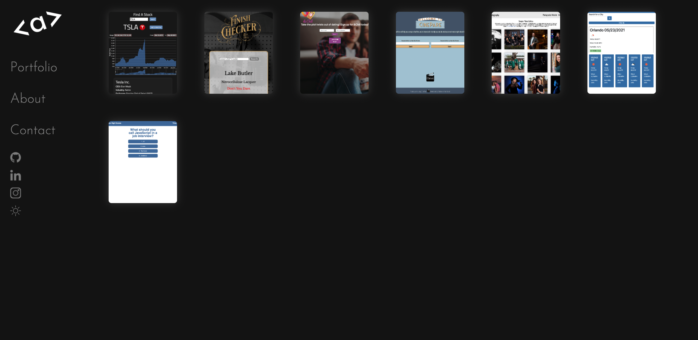
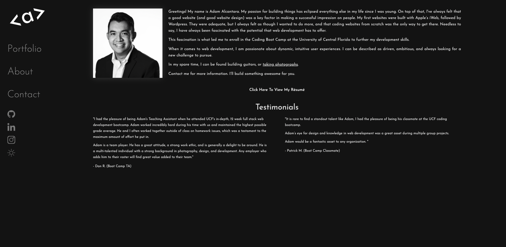

# Alcantara Development;
  

  ## Deployed Project
  [Alcantara Development](https://alcantaradevelopment.com/)

  ## Description 
My coding portfolio, which is built in React, that shows all my latest work.
  ## Table of Contents 

  * [Installation](#installation)
  * [Usage](#usage)
  * [License](#license)
  * [Contributing](#contributing)
  * [Contact](#contact)

  # Installation
  To run the installation, use the following code:
  npm i

  # Usage
  Create a clone of it to work on it.

  # License
  
  
  # Contributing
  Create a pull request.

  # Test
  

  # Contact
  If you have questions about anything relating to the code, please contact me at the following: 

  
  GitHub: 

  adamalcantara 

  Email 

  alcantaradevelopment@gmail.com 

  
